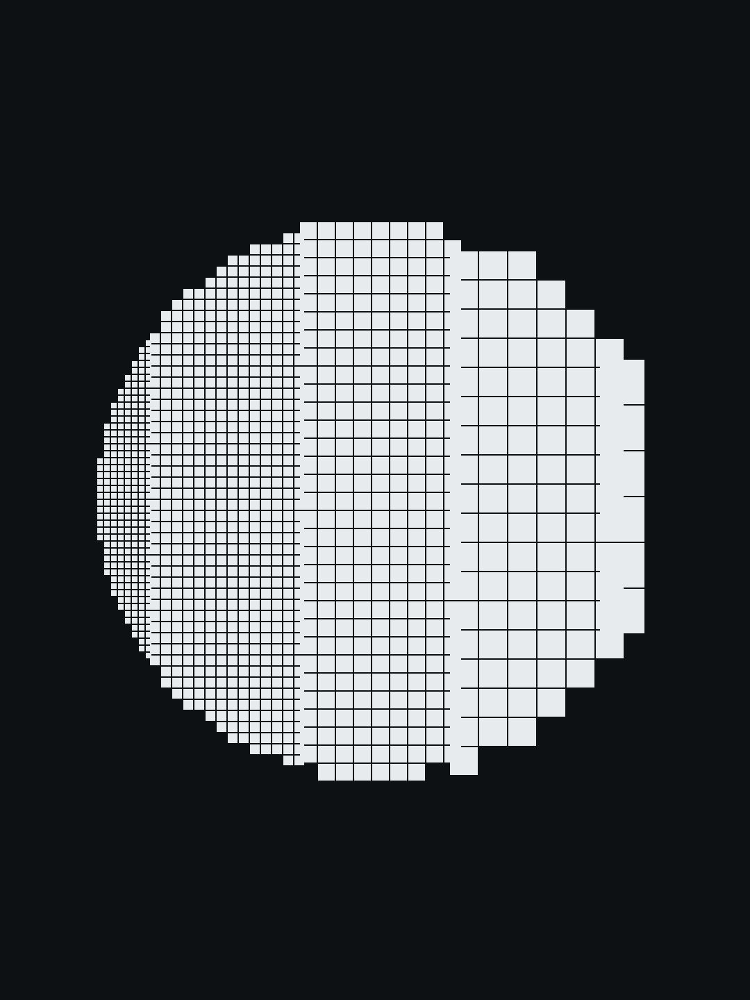

# ChatGPT 是整个互联网的一张模糊照片

> 编译自 Ted Chiang(特德·姜),《ChatGPT Is a Blurry JPEG of the Web》,The New Yorker,2023-02-09。

---

2013 年,德国一家建筑公司发现复印机出了怪事:复印一张房屋平面图,三个房间原本各标着面积——14.13、21.11、17.42 平方米——复印出来,三个全变成了 14.13。

一台复印机,把清清楚楚的数字悄悄改错,还让你看不出来。姜(Ted Chiang)说,想弄懂今天的 ChatGPT,可以先弄懂这台复印机。

## 有损压缩:糊得不明显,才是麻烦

公司找了计算机科学家来查。为什么找计算机科学家?因为现在的复印机早就不是老式的物理复印了——它先把文件扫成数字图像,再把图像打印出来。而几乎所有数字图像都会被压缩,好省空间。

压缩分两种。还原后和原件一模一样,叫无损压缩;还原后只是个近似,丢掉的信息再也找不回来,叫有损压缩。文本和程序用无损——错一个字符可能就是灾难。照片、音乐、视频常用有损——不完美通常没人在意。只有压得特别狠时,你才会看出毛病:图片发糊、起马赛克,音频发闷、有杂音。

那台复印机用的压缩方式,会把图里长得像的部分找出来、只存一份,还原时反复拿这一份去拼。它就是觉得三个面积数字"长得够像",只留了一个 14.13,打印时填回了三个房间。

**问题不在于它用了有损压缩,在于它糊得不明显。** 复印件要是整个模糊,谁都知道这不是准确的复制。麻烦的是它印出来的数字清晰、可读,却是错的——看着准,其实不准。(2014 年施乐发了补丁修这个。)

## 把 ChatGPT 想成整个网络的一张模糊照片

设想一下:你马上要永远断网。断之前,你想把全网的文字压一份存到自己的服务器上。可服务器空间只够装百分之一,想全塞进去就不能用无损。于是你写个有损算法,把文字里反复出现的规律找出来存下,靠海量算力把一百份的内容压成一份。

断网之后,你建个界面:你提问,它按存下的规律,给你一个大意。

**这就很像 ChatGPT——整个网络文字的一张模糊照片。** 网上的信息它留住了大半,就像一张压过的照片留住了原图的大半;但你要找一句一字不差的原文,找不到,你拿到的永远是个近似。只因为这个近似是用通顺的句子给出来的(ChatGPT 最擅长这个),你通常也就接受了。

## 幻觉,就是压缩痕迹

这个类比还解释了"幻觉"——大模型对着一个事实问题一本正经地胡说。

**幻觉就是压缩痕迹。** 跟复印机那些"可读但错"的数字一样,它够像真的,你要识别出来,只能拿原文、或者你自己对世界的了解去对照。这么想,幻觉一点都不奇怪:一个算法要在丢掉 99% 之后重建文本,它生成的内容里有一大块是彻底编的,本来就该预料到。

有损压缩还常用一招:缺了的地方,看两边、取中间。图像还原一个丢掉的像素,就看邻近像素取个平均,像调色时把两种颜色兑一下。你让 ChatGPT"用《独立宣言》的腔调,写一只袜子丢在烘干机里",它干的就是这件事:一头是《独立宣言》的文风,一头是丢袜子这件日常小事,它在两头之间兑出中间那一段。人觉得好玩——等于给段落发明了一个"模糊滤镜"。

## 它算"懂"了吗

把大模型说成"有损文本压缩",听着像贬低。但这个类比还有另一面:**压到极致,要靠理解。**

举个例子:一个文件里有一百万道加减乘除。想把它压到最小,最好的办法大概是推导出算术原理、写一个计算器程序。有了计算器,不光这一百万道能还原,以后遇到任何一道也能算。压一段维基百科同理:程序要是"懂"了"力 = 质量 × 加速度",压物理页面时就能扔掉很多字,反正它还原得回来。(有位研究者为此设了个奖,奖励谁能把一份维基百科无损压得更小。)

那 ChatGPT 呢?它找的是文字里的搭配规律:"供给不足"经常和"价格上涨"一起出现,于是你问它供给短缺的影响,它就答价格会涨。它攒了海量这种词与词的搭配,多到能对各种问题给出像样的回答——这算懂经济学吗?

姜写这篇时,拿 GPT-3(ChatGPT 的前身)试算术:两位数加减法几乎全对,数字一大就崩,五位数只剩一成对。它给对的那些,网上基本查不到("245 + 821"这种没多少网页写),所以不是背下来的;可它吃了那么多资料,也没能推导出算术原理。看它的错法,像是不会"进位"——网上明明有讲进位的,它没学进去。

> 编者注:2026 年的模型做算术已经好得多——但常常是直接调了个计算器来算。这反而印证了姜的意思:模型没学会算术,是绕过去了。

那它写大学论文为什么又像懂?姜给了个更朴素的解释:假如 ChatGPT 是无损的,它只会一字不差地引用网页,你多半觉得它不过是个强一点的搜索引擎,没什么惊艳。正因为它是转述、不是照抄,像个"用自己的话复述"的学生,而不是照着书背的学生,才造出了"它懂了"的错觉。在人身上,死记硬背不算真学会——所以 ChatGPT 引不出原文,反而让我们觉得它学到了东西。

**换句话说:让你觉得它聪明的那一点,恰恰是你不该信它的那一点。**

## 用"模糊照片"判断它能干什么

**代替搜索引擎?** 你得先知道这张照片没被喂进宣传和阴谋论,拍到的是网络里对的那部分。就算内容都对,还有"糊"的问题:换个说法重述,这种糊能接受;凭空编造,找事实时不能接受。技术上能不能只留前一种、去掉后一种,不清楚。

**用它生成网页内容?** 只在"把已有信息重新包装一遍"时才有意义——那是内容农场干的活。而**大模型生成的文字发得越多,网络就越是变成它自己的一张更糊的照片。**

> 编者注:这两条这几年基本应验了。AI 搜索会先查资料再回答,能压低编造,但压不到零;"能接受的糊"和"凭空编造"仍然分不干净。2024 年以后网上所谓"AI 泔水"泛滥,正是姜说的"网络变成自己更糊的版本"。

姜当年还预测:OpenAI 训练下一代模型时,会尽力排除 AI 生成的文本——反复重存一张压过的照片,痕迹越积越多,就像老式的"复印件的复印件",越印越差。他由此提出一个判断模型好坏的标准:一家公司愿不愿意拿它的输出去训练下一代模型。

> 编者注:后来更复杂——用模型自己造的数据来训练现在是主流做法,但要严格筛选。而"拿模型输出反复训练会导致质量崩溃"确实被证实了,"复印件的复印件"这个直觉站住了。

## 帮人写原创?差在初稿

有人说,大模型的输出跟人写的初稿也没多大区别。姜说这是表面相似:**你的初稿不是"清楚写出来的平庸想法",是"糟糕写出来的原创想法"**——它还带着你自己说不清的别扭,你能感觉到写出来的和想说的之间那段距离。是这段距离在指引你改。从 AI 生成的文字开始,缺的正是这个:文字挺顺,但那不是你的想法憋出来的,你也感觉不到那段该被填平的距离。

## 手里还有原件,一张糊图能值多少

写作没什么神秘的,但它不只是"把一份现成文件放进一台不靠谱的复印机、按下打印"。

也许将来会有一个 AI,能凭它自己对世界的经验写出好文章。那一天意义重大——但远在我们能预测的范围之外。

在那之前,姜留下一个问题:要永远失去互联网、只能往一台空间有限的服务器上存一份,ChatGPT 这样的东西也许是个好方案——前提是能管住它不编。可我们并没有在失去互联网。**当你手里还有原件,一张模糊的翻拍,到底能值多少?**

> 编者注:三年后再看,这个问题反而更尖了——现在网上的"原件"本身,越来越多也是模糊的。

---

配图:约翰·萨德勒(依马尔滕·德·沃斯原作),《几何》,选自《七种自由技艺》,约 1570–1600 年铜版画。大都会艺术博物馆开放获取,公共领域。
