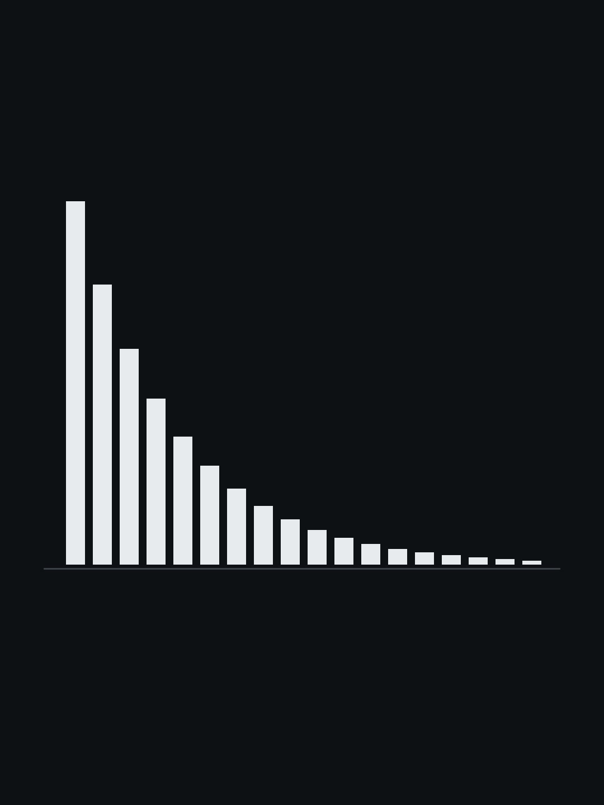

# 你的 AI 为啥总掉链子

你大概注意到过:让 AI 做一个小任务,它又快又好;把一个需要几十步、跑一两个小时的大任务整块交给它,它经常在半路上散架——不是某一步特别难,是整件事没串起来。

这不是"模型还不够聪明"能一句话打发的。近两年有三篇论文,分别从统计、实验和计算理论的角度,把这件事的结构讲清楚了,而且能回答一个更要紧的问题:这个毛病,能不能靠把模型做得更大来解决。

## 一、成功率随任务长度指数衰减,还能算出"半衰期"

先把任务用"一个人要花多少分钟做完"来度量。Toby Ord 在 2025 年的一篇论文里(arXiv 2505.05115,基于 METR 团队的实测数据)做了一个极简假设:让 AI 自己一步步干完(这种系统业内叫 agent),它在这段时间的每一分钟里,都有一个固定的翻车概率。

那么,一个需要 $T$ 分钟的任务、全程不翻车的概率,就是"每分钟不翻车概率"连乘 $T$ 次——写出来是

$$P(\text{成功}) = e^{-\lambda T}$$

一条往下掉的指数曲线,和放射性衰变是同一个公式。$\lambda$ 就是那个每分钟翻车率。

于是每个模型都有自己的"半衰期":任务长到某个时长,它的成功率正好掉到 50%。Ord 拟合出来,Claude 3.7 Sonnet 的半衰期大约是 59 分钟。

为什么偏偏是指数衰减?因为一个长任务,是一大堆子任务串在一起,**任何一个环节错了,整件事就错了**。假设每个环节的成功率是 $p$,$n$ 个环节全都成功的概率就是 $p^{\,n}$。$p$ 只要比 1 差一点点,乘几十次就撑不住了——掉下去的样子,和上面那条 $e^{-\lambda T}$ 是同一种。指数衰减的根,就在这个"全都得对"的结构里。

(Ord 说清楚了适用边界:这个模型只在一批特定的研究工程任务上验证过,能不能推广到别的任务,是没解决的问题。)

## 二、那让它自己检查一遍不行吗——不行

最自然的补救想法:让 AI 做完之后,自己回头查一遍。

Google DeepMind 团队的一篇论文(《Large Language Models Cannot Self-Correct Reasoning Yet》,ICLR 2024)专门测了这个,他们叫"内在自纠正"——不给任何外部反馈,只提示模型"你确定吗?再检查一遍"。

结果:在一组小学数学题上,GPT-3.5 自查两轮之后,把 7.6% 的答案从错改成了对,却把 8.8% 的答案从对改成了错——净亏。GPT-4 也一样,没有外部信号时,自查不提升,甚至下降。

原理很干净:**模型没有一个独立于自己的真值来源**。它"检查"的时候,靠的还是当初生成出那个错答案的同一个模型、同一套概率分布,没有任何新的、外部的信息进来。自我验证只在一种情况下有用——验证这件事本身比生成更容易,或者用到了生成时没有的信息。纯推理、没有外部核对,这个条件不成立。

## 三、真正管用的是"把过程写出来"——这有数学证明

第三篇论文(Merrill 和 Sabharwal,ICLR 2024)把这件事推到了计算理论的层面。

一个层数固定的 Transformer,把输入喂进去、直接给答案,它能做的计算有一个数学上的上限——大致是一种"又宽又浅"的电路:能一次并行算很多东西,但做不了那种一环扣一环、必须按顺序推很多步的计算。有些看起来很简单的问题,已经被证明它这样做不到,比如判断一张图里两个点连不连通。

但允许它先把中间步骤一个一个写出来(草稿纸,也就是 chain-of-thought),再顺着往下算,这个上限就被顶开了:**写出来的步数,换的是计算深度**——等于让一台"浅"机器,靠一张草稿纸,一步一步做出"深"的计算。

所以"想清楚再答""一步一步来",不是表达技巧,是真的扩大了这台机器能算的范围。

## 把三条合起来看

- 第一篇给出问题的形状:长任务的可靠性指数衰减,根源是"所有环节都得对"。
- 第二篇说:靠模型自查补不上,因为自查提供不了独立信号。
- 第三篇给出结构性的解法:把计算外置成写下来的中间步骤。

后两件事是同一个机制的两面。写下来的每一步,不只是让这台浅机器多算了一层——它还成了一样可以拿模型之外的工具单独核对的东西:一步算术交给计算器,一段代码交给编译器和测试,一个事实追到原始来源,一个中间结论交给另一个模型或一个人。这正好补上了第二篇说缺的那个独立信号。

## 那到底能不能靠更大的模型解决

不能靠"只把模型做大"解决。

放大模型,能把单个环节的成功率 $p$ 推得更高,把半衰期往后拖——这是真的,METR 测出来,这些年"能可靠完成的任务时长"一直在指数级地变长。但只要任务还是"$n$ 个环节全都得对"的结构,$p^{\,n}$ 照样会指数衰减,只是往下掉的那个点往后挪了。

所以能用的 agent 系统,不管底座模型多强,都是围着同样两个动作搭的:**把长任务拆成写下来的、短的、能单独核对的步骤;再拿模型之外的东西(测试、计算器、原始资料、另一个人),一步一步核对。** 这不是工程上偷懒的权宜之计,是上面三条结果各自指向的同一个方向。

一个补充:现在那批"推理模型",是把"写草稿、自我检查"这套动作,用一套奖惩机制反复练,直接练进了模型内部,而不是靠外面套一层。这确实把一部分原来要手动搭的脚手架吸收进了模型——但它改的是"每一步写得多好、拆得多合理",没有改"长任务里每一环都得对"这个前提。指数衰减这条曲线在往后移,不是在消失。

---

配图:雅各布·伯努利《猜度术》(Ars Conjectandi),1713 年首版内页。公共领域,来自 Wikimedia Commons。
